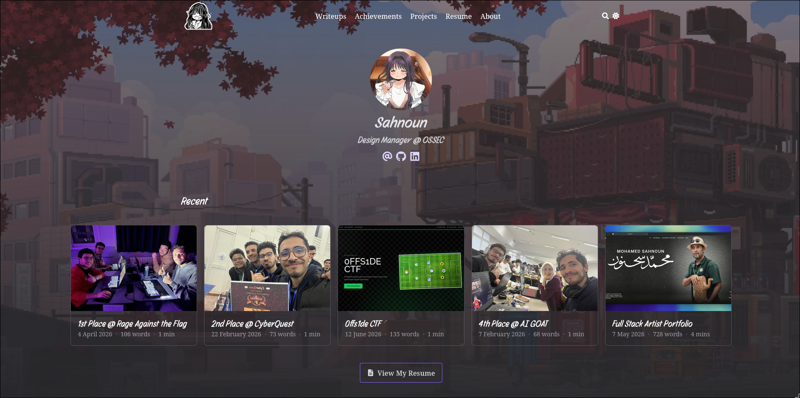

# sahnoun.dev

Personal portfolio and blog of Youssef Sahnoun — cybersecurity student, CTF player, and Design Manager @ OSSEC.

Live at **[sahnoun.dev](https://sahnoun.dev)**



---

## GitHub Stats


---

## Stack

| Layer | Tech |
|---|---|
| Static site generator | [Hugo](https://gohugo.io) + [Blowfish](https://blowfish.page) theme |
| CMS | [TinaCMS](https://tina.io) / [Decap CMS](https://decapcms.org) |
| Hosting | Vercel |
| Git push bridge | `push-server.js` (port 8082) |
| Local CMS backend | `local-server.js` (port 8083) |

## Content Sections

- **Writeups** — CTF writeups
- **Achievements** — certifications and competition placements
- **Projects** — personal projects
- **Resume** — CV page
- **About** — bio

## Local Development

**Requirements:** Node.js, Hugo extended

```bash
npm install
npm run dev
```

Starts three processes concurrently:
1. `decap-server` — local CMS backend (no git)
2. `push-server.js` — git push bridge on `:8082`
3. `hugo server` — dev server with live reload

## Environment Variables

| Variable | Purpose |
|---|---|
| `PUSH_SERVER_SECRET` | Bearer token for `push-server.js` (optional, enables auth) |
| `LOCAL_SERVER_SECRET` | Bearer token for `local-server.js` (optional, enables auth) |

Copy `.env.example` to `.env` and fill in values. `.env` is gitignored.

## Build

```bash
npm run build   # outputs to ./public
```

## Project Structure

```
content/        # Markdown content
layouts/        # Hugo template overrides
assets/         # CSS / JS / images
static/         # Served as-is (admin panel, media)
config/         # Hugo configuration (TOML)
tina/           # TinaCMS schema
push-server.js  # Git push HTTP bridge
local-server.js # Local CMS file API server
dev.sh          # Dev orchestration script
```
