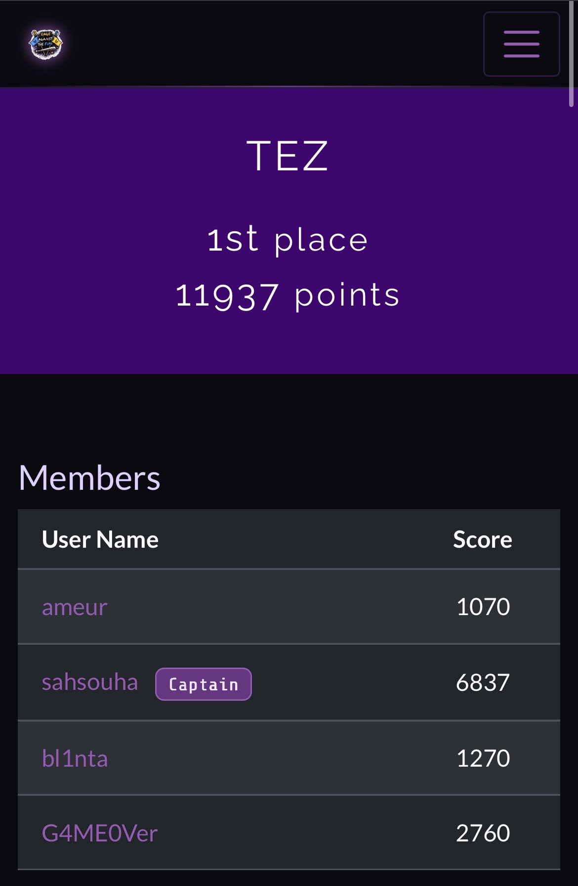
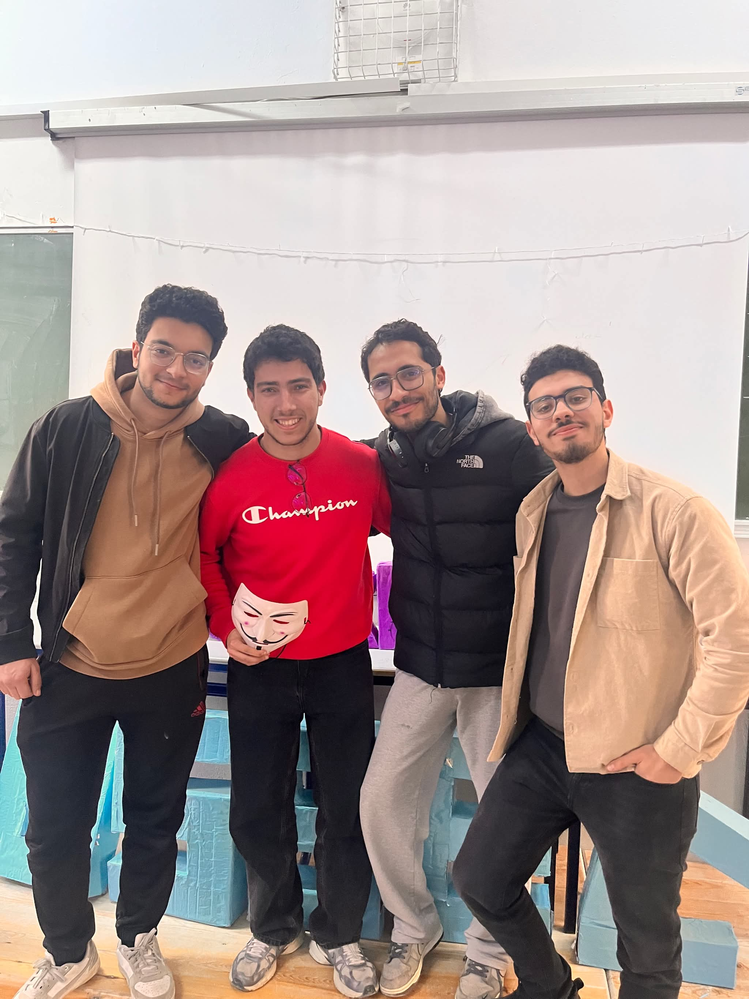

We came, we saw, **we pwned**. \
I'm incredibly proud to announce that team TEZ secured the top spot on the podium at the latest ***Rage Against The Flag*** CTF organized by **Securinets MSE & OSSEC ENSI !**

This victory was a masterclass in team synergy. My astonishing squad of three absolutely demolished the board: **G4M30Ver** completely took over the Forensics and Cryptography categories, **redeemer** dominated the Web challenges with precision, and **blinta** was unstoppable, ruthlessly clearing out every single *Wireshark* and network analysis challenge in sight. As for myself, I locked in and focused on clearing the board to maximize our points especially in **OSINT** challenges.

