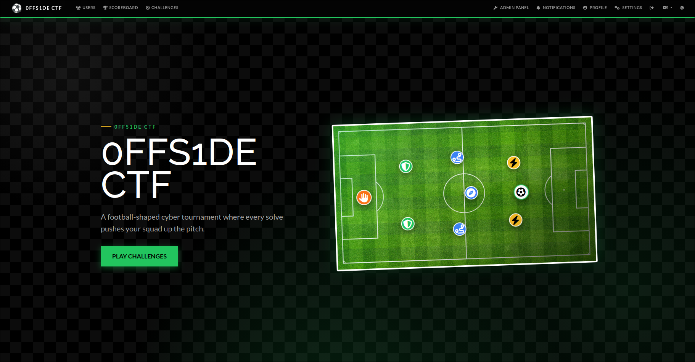

Get ready for **0ffside** **CTF**, a fast-paced, jeopardy-style cybersecurity competition designed to challenge enthusiasts, developers, and security professionals alike.

> **`https://0ffsidectf.ddns.net`**

Named after one of the most tactical rules in sports, ***0ffside CTF*** focuses on precision engineering, clever misdirection, and deep technical analysis. Competitors will face off across an intensive matrix of challenge categories, pushing teams to collaborate, think outside the box, and execute flawless solves under tight time constraints.

Categories Include:

* 🌐 **Web Exploitation** – Bypassing defenses and exploiting application flaws.
* 🔬 **Forensics & Network Analysis** – Deep-diving into the packet captures to trace malicious activity.
* 🔐 **Cryptography & Reverse Engineering** – Breaking encryption schemes and dismantling binaries.
* 🎯 **OSINT** – Tracking digital footprints and analyzing complex intelligence scenarios.

Secure your spot on the grid. Build your squad, review your playbooks, and prepare for kickoff.

