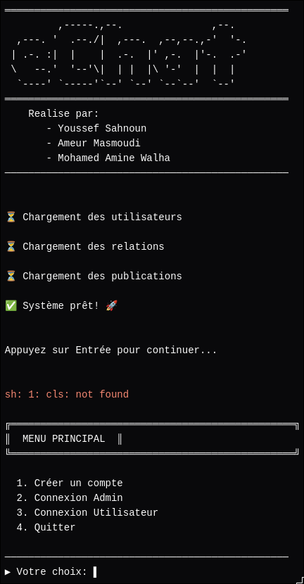

A Social Network console application developed in C. This application manages users (including password authentication), friendships, subscriptions (follows), and posts. \
\
Designed as an educational project for the C Programming course at **ENSI**, it features simple data persistence alongside both user and administrator functionalities.

*[`Source Code`](https://github.com/ENSI-Sahnoun/eChat)*

